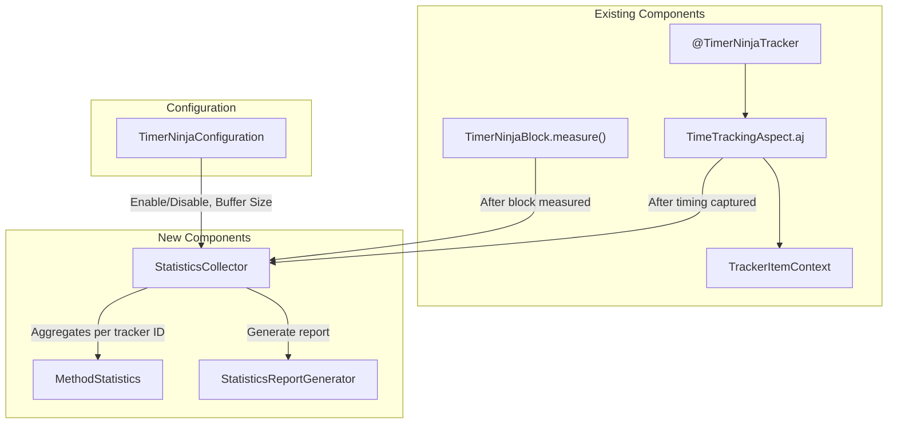

# Minimal In-Memory Statistics Tracking - Implementation Plan (Revised)

> **Feature**: In-Memory Statistics with p50, p90, p95, avg execution time tracking  
> **Version Target**: v1.3.0  
> **Date**: January 31, 2026  
> **Revision**: 2 - Incorporates user feedback

---

## Goal Description

Add capability for Timer Ninja to collect and aggregate execution time statistics across multiple method invocations. Users can enable statistics tracking, and later retrieve a report containing:

- **Invocation count** per method
- **Average** execution time (calculated on-demand)
- **Percentile metrics**: p50, p90, p95
- **Min/Max** execution time
- **Threshold statistics**: count of executions within/exceeding threshold

The feature must:
1. ✅ **Not break existing implementation** - Statistics tracking is opt-in
2. ✅ **Minimize performance overhead** - Calculations done on report extraction only
3. ✅ **Remain self-contained** - No external dependencies (HTML uses CDN for styling)

---

## User Feedback Incorporated

| Feedback | Resolution |
|----------|------------|
| Support `TimerNinjaBlock` capture | ✅ Added statistics recording in `TimerNinjaBlock.measure()` |
| Unique method identifier | ✅ Added `trackerId` to annotation, uses `class.method` as default key |
| Threshold tracking | ✅ Added threshold config and exceed/within counts to `MethodStatistics` |
| HTML report with hierarchical view | ✅ Added self-contained HTML with Bootstrap CDN, collapsible parent-child |
| Rename config method | ✅ Changed to `enableStatisticsReporting(boolean)` |
| Binary report for REST download | ✅ Report methods return `byte[]` or `String` |
| On-demand calculation | ✅ All percentile/avg calculations done only on report extraction |
| Shortened signature configurable | ✅ Added `setUseFullMethodSignature(boolean)` config option |

---

## Architecture Overview



---

## Proposed Changes

### Core Statistics Infrastructure

#### [NEW] [MethodStatistics.java](file:///Users/thanglequoc/projects/GitHub/timer-ninja/src/main/aspectj/io/github/thanglequoc/timerninja/MethodStatistics.java)

Statistics holder for a single tracker (identified by unique `trackerId`).

```java
public class MethodStatistics {
    private final String trackerId;           // Unique ID (user-defined or auto-generated)
    private final String methodSignature;     // e.g., "processPayment(User, int)"
    private final String className;           // e.g., "com.example.PaymentService"
    private final List<Long> executionTimes;  // Circular buffer (FIFO eviction)
    private final int maxBufferSize;
    
    // Threshold tracking
    private int thresholdMs = -1;             // Configured threshold (-1 = not set)
    private int thresholdExceededCount = 0;
    private int thresholdWithinCount = 0;
    
    // Parent-child hierarchy for nested calls
    private String parentTrackerId;           // null if root
    private List<String> childTrackerIds;
    
    // Methods (calculations done on-demand, not on record):
    // - recordExecution(long timeInMillis, boolean exceededThreshold)
    // - getInvocationCount()
    // - calculateAverage()        // Computed on-demand
    // - calculatePercentile(int)  // Computed on-demand
    // - getMin(), getMax()
    // - getThresholdExceededCount(), getThresholdWithinCount()
    // - reset()
}
```

**Key Design Decisions**:
- **Unique `trackerId`**: Defaults to `className.methodName` but can be overridden via annotation
- **FIFO eviction**: When buffer is full, oldest entries are discarded
- **On-demand calculations**: `calculateAverage()` and `calculatePercentile()` compute on call, not on record
- **Thread-safe**: Uses `synchronized` blocks for recording

---

#### [NEW] [StatisticsCollector.java](file:///Users/thanglequoc/projects/GitHub/timer-ninja/src/main/aspectj/io/github/thanglequoc/timerninja/StatisticsCollector.java)

Singleton managing statistics collection for all tracked methods.

```java
public class StatisticsCollector {
    private static StatisticsCollector instance;
    
    // Tracker ID -> Statistics
    private final ConcurrentHashMap<String, MethodStatistics> statisticsMap;
    private int maxBufferSizePerMethod = 1000;
    
    // Methods:
    // - recordExecution(String trackerId, String className, String methodSignature, 
    //                   long executionTimeMs, int thresholdMs, String parentTrackerId)
    // - getStatistics(String trackerId)
    // - getAllStatistics()
    // - reset()
    // - setMaxBufferSize(int size)
}
```

---

#### [NEW] [StatisticsReportGenerator.java](file:///Users/thanglequoc/projects/GitHub/timer-ninja/src/main/aspectj/io/github/thanglequoc/timerninja/StatisticsReportGenerator.java)

Utility class for generating formatted statistics reports.

```java
public class StatisticsReportGenerator {
    // Report generation methods (return String or byte[]):
    // - generateTextReport(Map<String, MethodStatistics> stats)
    // - generateJsonReport(Map<String, MethodStatistics> stats)
    // - generateHtmlReport(Map<String, MethodStatistics> stats)
    
    // Binary export for REST download:
    // - getReportAsBytes(String format)  // "text", "json", "html"
}
```

---

### Report Formats

#### Text Report
```
===== Timer Ninja Statistics Report =====
Generated: 2026-01-31T23:00:00Z
Total tracked methods: 3

Tracker ID                                | Count | Avg    | p50    | p90    | p95    | Min    | Max    | Threshold↑ | Threshold↓
------------------------------------------|-------|--------|--------|--------|--------|--------|--------|------------|------------
PaymentService.processPayment             | 1,234 | 156ms  | 142ms  | 289ms  | 312ms  | 45ms   | 512ms  | 23         | 1,211
  └─ AccountService.changeAmount          | 1,234 | 89ms   | 76ms   | 145ms  | 167ms  | 23ms   | 289ms  | 5          | 1,229
UserService.findUser                      | 3,456 | 45ms   | 38ms   | 102ms  | 118ms  | 12ms   | 234ms  | -          | -

===== End of Report =====
```

#### JSON Report
```json
{
  "generatedAt": "2026-01-31T23:00:00Z",
  "totalMethods": 3,
  "trackers": [
    {
      "trackerId": "PaymentService.processPayment",
      "className": "com.example.PaymentService",
      "methodSignature": "processPayment(User, int)",
      "count": 1234,
      "avgMs": 156,
      "p50Ms": 142,
      "p90Ms": 289,
      "p95Ms": 312,
      "minMs": 45,
      "maxMs": 512,
      "thresholdMs": 200,
      "thresholdExceeded": 23,
      "thresholdWithin": 1211,
      "children": [
        {
          "trackerId": "AccountService.changeAmount",
          ...
        }
      ]
    }
  ]
}
```

#### HTML Report (Self-Contained)

Self-contained HTML file with **Bootstrap 5 via CDN** for styling. Features:
- Responsive table layout
- Collapsible rows for parent-child hierarchy (using Bootstrap accordion/collapse)
- Color-coded threshold exceed counts
- Download-ready (can be served as binary via REST)

```html
<!DOCTYPE html>
<html lang="en">
<head>
    <meta charset="UTF-8">
    <meta name="viewport" content="width=device-width, initial-scale=1.0">
    <title>Timer Ninja Statistics Report</title>
    <link href="https://cdn.jsdelivr.net/npm/bootstrap@5.3.0/dist/css/bootstrap.min.css" rel="stylesheet">
    <style>
        .threshold-exceed { color: #dc3545; font-weight: bold; }
        .threshold-within { color: #198754; }
        .child-row { background-color: #f8f9fa; }
        .expand-btn { cursor: pointer; }
    </style>
</head>
<body class="bg-dark text-light">
    <div class="container py-4">
        <h1 class="mb-4">🥷 Timer Ninja Statistics Report</h1>
        <p class="text-muted">Generated: 2026-01-31T23:00:00Z</p>
        
        <table class="table table-dark table-striped table-hover">
            <thead>
                <tr>
                    <th>Tracker ID</th>
                    <th>Count</th>
                    <th>Avg</th>
                    <th>p50</th>
                    <th>p90</th>
                    <th>p95</th>
                    <th>Min</th>
                    <th>Max</th>
                    <th>Threshold↑</th>
                    <th>Threshold↓</th>
                </tr>
            </thead>
            <tbody>
                <!-- Parent row with expand button -->
                <tr data-bs-toggle="collapse" data-bs-target="#children-1" class="expand-btn">
                    <td>▶ PaymentService.processPayment</td>
                    <td>1,234</td>
                    <td>156ms</td>
                    <!-- ... -->
                </tr>
                <!-- Collapsible child rows -->
                <tr id="children-1" class="collapse child-row">
                    <td class="ps-4">└─ AccountService.changeAmount</td>
                    <!-- ... -->
                </tr>
            </tbody>
        </table>
    </div>
    <script src="https://cdn.jsdelivr.net/npm/bootstrap@5.3.0/dist/js/bootstrap.bundle.min.js"></script>
</body>
</html>
```

---

### Annotation Enhancement

#### [MODIFY] [TimerNinjaTracker.java](file:///Users/thanglequoc/projects/GitHub/timer-ninja/src/main/aspectj/io/github/thanglequoc/timerninja/TimerNinjaTracker.java)

Add `trackerId` parameter for unique identification.

```diff
@Retention(RetentionPolicy.RUNTIME)
@Target({ElementType.CONSTRUCTOR, ElementType.METHOD})
public @interface TimerNinjaTracker {
    ChronoUnit timeUnit() default ChronoUnit.MILLIS;
    boolean enabled() default true;
    boolean includeArgs() default false;
    int threshold() default -1;
    
+   /**
+    * Unique identifier for this tracker in statistics.
+    * If empty, defaults to "ClassName.methodName".
+    * Useful when same method signature exists in different classes.
+    */
+   String trackerId() default "";
}
```

---

### Configuration Enhancement

#### [MODIFY] [TimerNinjaConfiguration.java](file:///Users/thanglequoc/projects/GitHub/timer-ninja/src/main/aspectj/io/github/thanglequoc/timerninja/TimerNinjaConfiguration.java)

```diff
public class TimerNinjaConfiguration {
    private static TimerNinjaConfiguration instance;
    private boolean enabledSystemOutLog;
+   private boolean statisticsReportingEnabled = false;
+   private int statisticsBufferSize = 1000;
+   private boolean useFullMethodSignature = false;  // Shortened by default

    // ... existing methods ...

+   /** Enable/disable statistics collection. */
+   public synchronized void enableStatisticsReporting(boolean enabled);
+   public boolean isStatisticsReportingEnabled();
+   
+   /** Set max samples per tracker (default: 1000). FIFO eviction when full. */
+   public synchronized void setStatisticsBufferSize(int size);
+   public int getStatisticsBufferSize();
+   
+   /** Use full method signature in reports (default: false = shortened). */
+   public synchronized void setUseFullMethodSignature(boolean useFull);
+   public boolean isUseFullMethodSignature();
+   
+   /** Get the StatisticsCollector instance. */
+   public StatisticsCollector getStatisticsCollector();
+   
+   /** Print statistics report to the configured logger. */
+   public void printStatisticsReport();
+   
+   /** Get report as string. @param format "text", "json", or "html" */
+   public String getStatisticsReportAsString(String format);
+   
+   /** Get report as bytes (for REST download). @param format "text", "json", or "html" */
+   public byte[] getStatisticsReportAsBytes(String format);
+   
+   /** Reset all collected statistics. */
+   public void resetStatistics();
}
```

---

### AspectJ Integration

#### [MODIFY] [TimeTrackingAspect.aj](file:///Users/thanglequoc/projects/GitHub/timer-ninja/src/main/aspectj/io/github/thanglequoc/timerninja/TimeTrackingAspect.aj)

Add statistics recording after timing captured.

```diff
Object around(): methodAnnotatedWithTimerNinjaTracker() {
    // ... existing code ...
    
+   // Get tracker ID (custom or auto-generated)
+   String trackerId = TimerNinjaUtil.getTrackerId(methodSignature);
+   String className = methodSignature.getDeclaringType().getName();
    
    // Method invocation
    long startTime = System.currentTimeMillis();
    Object object = proceed();
    long endTime = System.currentTimeMillis();
+   long executionTimeMs = endTime - startTime;
    
    if (isTrackerEnabled) {
        ChronoUnit trackingTimeUnit = TimerNinjaUtil.getTrackingTimeUnit(methodSignature);
-       long executionTime = TimerNinjaUtil.convertFromMillis(endTime - startTime, trackingTimeUnit);
+       long executionTime = TimerNinjaUtil.convertFromMillis(executionTimeMs, trackingTimeUnit);
        trackerItemContext.setExecutionTime(executionTime);
        trackerItemContext.setTimeUnit(trackingTimeUnit);
        
+       // Record statistics if enabled
+       if (TimerNinjaConfiguration.getInstance().isStatisticsReportingEnabled()) {
+           String parentTrackerId = trackingCtx.getParentTrackerId();
+           StatisticsCollector.getInstance().recordExecution(
+               trackerId, className, methodSignatureString,
+               executionTimeMs, threshold, parentTrackerId
+           );
+       }
        
        trackingCtx.decreasePointerDepth();
    }
    // ... rest unchanged ...
}
```

> [!NOTE]
> The same modification applies to the constructor advice.

---

### Block-based Tracking Integration

#### [MODIFY] [TimerNinjaBlock.java](file:///Users/thanglequoc/projects/GitHub/timer-ninja/src/main/aspectj/io/github/thanglequoc/timerninja/TimerNinjaBlock.java)

Add statistics recording to block-based measurement.

```diff
public static void measure(String blockName, BlockTrackerConfig config, Runnable codeBlock) {
    // ... existing timing logic ...
    
    long startTime = System.currentTimeMillis();
    codeBlock.run();
    long endTime = System.currentTimeMillis();
+   long executionTimeMs = endTime - startTime;
    
    // ... existing trace context handling ...
    
+   // Record statistics if enabled
+   if (TimerNinjaConfiguration.getInstance().isStatisticsReportingEnabled()) {
+       String trackerId = (config != null && config.getTrackerId() != null) 
+           ? config.getTrackerId() 
+           : "Block:" + blockName;
+       int threshold = (config != null) ? config.getThreshold() : -1;
+       String parentTrackerId = (trackingCtx != null) ? trackingCtx.getParentTrackerId() : null;
+       
+       StatisticsCollector.getInstance().recordExecution(
+           trackerId, "TimerNinjaBlock", blockName,
+           executionTimeMs, threshold, parentTrackerId
+       );
+   }
}
```

#### [MODIFY] [BlockTrackerConfig.java](file:///Users/thanglequoc/projects/GitHub/timer-ninja/src/main/aspectj/io/github/thanglequoc/timerninja/BlockTrackerConfig.java)

Add `trackerId` configuration.

```diff
public class BlockTrackerConfig {
    private ChronoUnit timeUnit = ChronoUnit.MILLIS;
    private int threshold = -1;
+   private String trackerId;
    
+   public BlockTrackerConfig setTrackerId(String trackerId) {
+       this.trackerId = trackerId;
+       return this;
+   }
+   public String getTrackerId() { return trackerId; }
}
```

---

## API Usage Examples

### Basic Usage

```java
// Enable statistics tracking
TimerNinjaConfiguration config = TimerNinjaConfiguration.getInstance();
config.enableStatisticsReporting(true);
config.setStatisticsBufferSize(500);  // Optional

// ... application runs, methods execute ...

// Get report as string
String textReport = config.getStatisticsReportAsString("text");
String jsonReport = config.getStatisticsReportAsString("json");
String htmlReport = config.getStatisticsReportAsString("html");

// Get report as bytes (for REST download)
byte[] htmlBytes = config.getStatisticsReportAsBytes("html");
```

### REST Endpoint Example (Spring Boot)

```java
@RestController
@RequestMapping("/api/timer-ninja")
public class TimerNinjaStatsController {

    @PostMapping("/report")
    public ResponseEntity<byte[]> downloadReport(
            @RequestParam(defaultValue = "html") String format) {
        
        byte[] report = TimerNinjaConfiguration.getInstance()
            .getStatisticsReportAsBytes(format);
        
        String contentType = switch (format) {
            case "json" -> "application/json";
            case "html" -> "text/html";
            default -> "text/plain";
        };
        
        String filename = "timer-ninja-report." + 
            (format.equals("text") ? "txt" : format);
        
        return ResponseEntity.ok()
            .contentType(MediaType.parseMediaType(contentType))
            .header("Content-Disposition", "attachment; filename=" + filename)
            .body(report);
    }
    
    @PostMapping("/reset")
    public ResponseEntity<Void> resetStatistics() {
        TimerNinjaConfiguration.getInstance().resetStatistics();
        return ResponseEntity.ok().build();
    }
}
```

### Custom Tracker ID

```java
// Avoid collision when same method signature exists in multiple classes
@TimerNinjaTracker(trackerId = "billing.processPayment")
public void processPayment(User user, int amount) { }

// In another class with same method name
@TimerNinjaTracker(trackerId = "refund.processPayment")
public void processPayment(User user, int amount) { }
```

### Block-based Tracking with ID

```java
BlockTrackerConfig config = new BlockTrackerConfig()
    .setTrackerId("custom-batch-process")
    .setThreshold(500);

TimerNinjaBlock.measure("batch processing", config, () -> {
    processBatch(items);
});
```

---

## Performance Considerations

| Operation | Overhead | Notes |
|-----------|----------|-------|
| Statistics enabled check | ~1ns | Simple boolean check |
| Recording execution | ~50-100ns | HashMap get + list add + counter increment |
| Avg/Percentile calculation | O(n log n) | Only on report extraction, not on record |
| Report generation | O(m × n log n) | m = methods, n = samples per method |
| Memory per tracker | ~8KB | 1000 samples × 8 bytes per Long |

---

## Verification Plan

### Automated Tests

#### [NEW] [StatisticsCollectorTest.java](file:///Users/thanglequoc/projects/GitHub/timer-ninja/src/test/aspectj/io/github/thanglequoc/timerninja/StatisticsCollectorTest.java)

| Test Case | Description |
|-----------|-------------|
| `testRecordWithCustomTrackerId` | Verify recording with user-defined tracker ID |
| `testAutoGeneratedTrackerId` | Verify `ClassName.methodName` default |
| `testThresholdExceedCount` | Verify threshold exceed/within counts |
| `testParentChildHierarchy` | Verify parent-child relationship tracking |
| `testBufferOverflowFIFO` | Verify FIFO eviction when buffer full |
| `testConcurrentAccess` | Verify thread-safety |

#### [NEW] [StatisticsReportGeneratorTest.java](file:///Users/thanglequoc/projects/GitHub/timer-ninja/src/test/aspectj/io/github/thanglequoc/timerninja/StatisticsReportGeneratorTest.java)

| Test Case | Description |
|-----------|-------------|
| `testTextReportFormat` | Verify text output format |
| `testJsonReportValid` | Verify JSON is valid and parseable |
| `testHtmlReportContainsBootstrap` | Verify HTML contains Bootstrap CDN |
| `testHtmlReportHierarchy` | Verify collapsible rows for child trackers |
| `testReportAsBytes` | Verify byte[] output for downloads |

### Test Commands

```bash
cd /Users/thanglequoc/projects/GitHub/timer-ninja
./gradlew test
```

---

## Files Summary

| File | Action | Description |
|------|--------|-------------|
| `MethodStatistics.java` | NEW | Per-tracker stats with threshold tracking |
| `StatisticsCollector.java` | NEW | Singleton collector manager |
| `StatisticsReportGenerator.java` | NEW | Text/JSON/HTML report generation |
| `TimerNinjaTracker.java` | MODIFY | Add `trackerId` parameter |
| `TimerNinjaConfiguration.java` | MODIFY | Add statistics config methods |
| `TimeTrackingAspect.aj` | MODIFY | Add recording hook |
| `TimerNinjaBlock.java` | MODIFY | Add statistics recording |
| `BlockTrackerConfig.java` | MODIFY | Add `trackerId` config |
| `StatisticsCollectorTest.java` | NEW | Unit tests |
| `StatisticsReportGeneratorTest.java` | NEW | Report tests |
| `README.md` | MODIFY | Add documentation |

---

## Implementation Order

1. **Phase 1**: Core classes
   - `MethodStatistics.java` with threshold tracking
   - `StatisticsCollector.java` with tracker ID support
   - `StatisticsReportGenerator.java` (text, JSON, HTML)
   - Unit tests

2. **Phase 2**: Integration
   - Modify `TimerNinjaTracker.java` to add `trackerId`
   - Modify `TimerNinjaConfiguration.java`
   - Modify `TimeTrackingAspect.aj`
   - Modify `TimerNinjaBlock.java` and `BlockTrackerConfig.java`

3. **Phase 3**: Testing & Documentation
   - Integration tests
   - Update README.md
